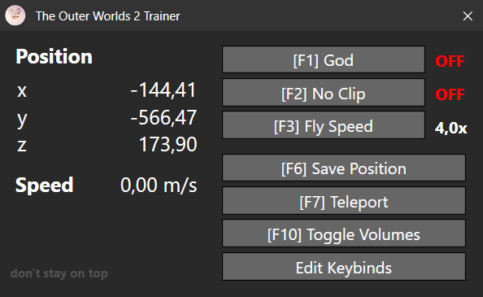

# The Outer Worlds 2 Trainer

Game trainer for [The Outer Worlds 2](https://https://www.pcgamingwiki.com/wiki/The_Outer_Worlds_2)

## Features
- Position and Speed readouts
- Store and Teleport position
- Noclip (adjustable fly speed)
- God Mode
- Toggle Blocking- & KillVolume visuals

## Download
Click [here](https://github.com/Micrologist/TOW2Trainer/releases/latest/download/TOW2Trainer.1.2.zip) to download the latest version.

## Requirements

- [.NET 8.0 Runtime](https://dotnet.microsoft.com/download/dotnet/8.0) (or SDK if you plan to build from source)